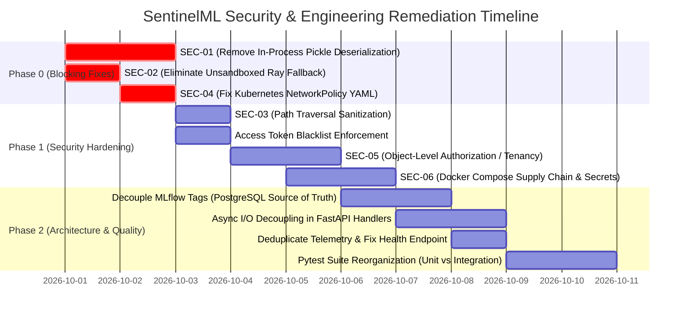

# SentinelML — Audit Remediation Plan & Engineering Blueprint

**Date:** September 29, 2026  
**Auditor:** SentinelML Automated Security & Software Assurance  
**Target Git Branch:** `continuous_training`  
**Purpose:** Concrete, step-by-step remediation blueprints and implementation plan for all defects uncovered in the Software & Security Audit, establishing a hardened foundation before developing Data Drift, Concept Drift, Model Monitoring, and Continuous Training.

---

## 1. Prioritized Remediation Roadmap



---

## 2. Phase 0: Critical Blocking Remediations

### 2.1 Remediation for SEC-01: Remove In-Process Pickle Deserialization

#### Problem
[backend/app/services/ml_ops/registry_service.py:326-336](file:///home/deepadharshan/Desktop/Capstone_MLSecOps/backend/app/services/ml_ops/registry_service.py#L326-L336) deserializes `.pkl` files with `cloudpickle.load(f)` directly in the host web server process.

#### Remediation Architecture
1. **Never load pickle files into the FastAPI web process.**
2. If signature inference is required, offload inspection to an isolated ephemeral Kubernetes Job or RayJob with a non-root, network-isolated container.
3. For immediate zero-risk remediation: Require the user/client to provide explicit model input/output schema parameters in the upload request JSON metadata, or save the model artifact directly to MLflow using MLflow's native artifact transport without local python unpickling.
4. Support secure serialization formats: Encourage **ONNX** or **Safetensors** for model serialization, which cannot execute arbitrary bytecode during deserialization.

#### Proposed Code Diff Blueprint
```diff
--- a/backend/app/services/ml_ops/registry_service.py
+++ b/backend/app/services/ml_ops/registry_service.py
@@ -323,17 +323,9 @@ class ModelRegistryService:
         with tempfile.NamedTemporaryFile(delete=False, suffix=".pkl") as f:
             f.write(file_content)
             temp_path = f.name
 
-        # Load model to infer signature
-        try:
-            with open(temp_path, "rb") as f:
-                try:
-                    model = cloudpickle.load(f)
-                except Exception:
-                    f.seek(0)
-                    model = pickle.load(f)
-        except Exception as e:
-            raise HTTPException(status_code=400, detail=f"Invalid pickle format: {e}")
+        # SECURITY FIX (SEC-01): Never deserialize untrusted pickle payloads inside
+        # the FastAPI server process. Log model metadata without in-memory code execution.
+        # Model signature validation is delegated to containerized worker pods.
 
         # Log to MLflow under active run
         with mlflow.start_run(run_name=f"upload_{model_name}") as run:
```

---

### 2.2 Remediation for SEC-02: Eliminate Unsandboxed Host Ray Fallback

#### Problem
[backend/app/services/ml_ops/utils.py:291-321](file:///home/deepadharshan/Desktop/Capstone_MLSecOps/backend/app/services/ml_ops/utils.py#L291-L321) executes arbitrary user Python code via `sys.executable` on the host machine when `ALLOW_LOCAL_RAY_FALLBACK=True`.

#### Remediation Architecture
1. In production, remove `spawn_local_ray_subprocess` from fallback paths.
2. In development environments where Kubernetes is unavailable, execute user training scripts exclusively within an isolated Docker container:
   ```bash
   docker run --rm \
     --network none \
     --memory 2g \
     --cpus 1.0 \
     --security-opt no-new-privileges \
     --user 1000:1000 \
     -v /tmp/isolated_training:/workspace:ro \
     sentinelml-training-sandbox:latest python /workspace/user_code.py
   ```
3. Hardcode a configuration validation check: If `ENVIRONMENT == "production"` and `ALLOW_LOCAL_RAY_FALLBACK == True`, FastAPI startup must abort with a fatal configuration error.

---

### 2.3 Remediation for SEC-04: Fix Kubernetes NetworkPolicy YAML Syntax

#### Problem
[k8s/rayjob-network-policy.yaml:50-52](file:///home/deepadharshan/Desktop/Capstone_MLSecOps/k8s/rayjob-network-policy.yaml#L50-L52) defines duplicate `port:` keys in the same mapping item, dropping port 9000.

#### Proposed Code Diff Blueprint
```diff
--- a/k8s/rayjob-network-policy.yaml
+++ b/k8s/rayjob-network-policy.yaml
@@ -48,6 +48,7 @@ spec:
         - protocol: TCP
           port: 8000   # LakeFS data versioning API
         - protocol: TCP
           port: 9000   # MinIO S3 object storage
+        - protocol: TCP
           port: 5000   # MLflow tracking server
```

---

## 3. Phase 1: Security Hardening & Session Security

### 3.1 Remediation for SEC-03: Path Traversal Sanitization

#### Problem
[backend/app/api/datasets.py:147-165](file:///home/deepadharshan/Desktop/Capstone_MLSecOps/backend/app/api/datasets.py#L147-L165) accepts unvalidated file paths in download and streaming routes.

#### Proposed Code Diff Blueprint
```python
import os
from pathlib import PurePosixPath

def sanitize_repository_path(path: str) -> str:
    """
    Validates and sanitizes repository object paths:
    - Rejects path traversal sequences (../, ..\)
    - Rejects absolute filesystem paths
    - Normalizes multi-slashes
    """
    clean_path = str(PurePosixPath(path))
    if clean_path.startswith("/") or clean_path.startswith("\\"):
        clean_path = clean_path.lstrip("/\\")
    
    parts = clean_path.split("/")
    if ".." in parts or "." in parts:
        raise HTTPException(
            status_code=400,
            detail="Invalid file path. Path traversal sequences are strictly forbidden."
        )
    return clean_path
```

### 3.2 Remediation for Token Blacklist Verification in JWT Dependency

#### Problem
When users log out, the access token's `jti` is inserted into `blacklisted_tokens`, but `get_current_user` in `backend/app/api/auth.py` only decodes the JWT without querying the blacklist repository.

#### Proposed Code Diff Blueprint
```diff
--- a/backend/app/api/auth.py
+++ b/backend/app/api/auth.py
@@ -101,6 +101,11 @@ def get_current_user(
         raise HTTPException(status_code=401, detail="Invalid token claims.")
 
+    # Check if access token has been revoked
+    blacklist_repo = BlacklistedTokenRepository(db)
+    if payload.get("jti") and blacklist_repo.get_by_jti(payload["jti"]):
+        raise HTTPException(status_code=401, detail="Token has been revoked.")
+
     user = user_repo.get_by_id(UUID(user_id))
     if not user or not user.is_active:
         raise HTTPException(status_code=401, detail="User inactive or not found.")
```

### 3.3 Remediation for SEC-05: Object-Level Authorization (Tenancy)

#### Blueprint
1. Add an ownership check helper in `app/api/dependencies.py`:
   ```python
   def verify_dataset_ownership(dataset: Dataset, current_user: User) -> None:
       if current_user.role == "admin":
           return
       if dataset.created_by_id != current_user.id:
           raise HTTPException(
               status_code=403,
               detail="Access forbidden: You do not have permission to access this resource."
           )
   ```
2. Apply `verify_dataset_ownership` to dataset download, deletion, branching, and commit routes.

### 3.4 Remediation for SEC-06: Pre-build MLflow Docker Image & Restrict Port Bindings

#### Blueprint
1. Create `docker/mlflow/Dockerfile`:
   ```dockerfile
   FROM ghcr.io/mlflow/mlflow:v3.15.1
   RUN pip install --no-cache-dir \
       psycopg2-binary==2.9.9 \
       boto3==1.34.144 \
       cryptography==42.0.8
   ```
2. Update `docker-compose.yml` to build this image locally instead of running unpinned `pip install` dynamically at container startup.
3. Restrict host port exposures in `docker-compose.yml`:
   ```yaml
   ports:
     - "127.0.0.1:5432:5432" # postgres
     - "127.0.0.1:9000:9000" # minio api
     - "127.0.0.1:9001:9001" # minio console
     - "127.0.0.1:8000:8000" # lakefs
     - "127.0.0.1:5000:5000" # mlflow
   ```

---

## 4. Phase 2: Architecture & Software Quality Remediations

### 4.1 Decouple Deployments from MLflow Tags (PostgreSQL as Source of Truth)

#### Blueprint
1. In `ModelServingService._execute_model_prediction`:
   - Replace `mlflow_client.search_model_versions("")` with a query against the PostgreSQL `deployments` table via `DeploymentRepository`:
   ```python
   deployment = deployment_repo.get_active_by_model(model_name_or_id, environment="staging")
   if not deployment:
       raise HTTPException(status_code=503, detail="No active deployment found.")
   endpoint = deployment.endpoint_url
   ```
2. This eliminates latency, dependency on MLflow availability for live prediction routing, and synchronizes status directly with Kubernetes events.

### 4.2 Fix Duplicate Telemetry Instrumentation in `main.py`

#### Blueprint
Remove top-level module invocations in [backend/app/main.py:101-103](file:///home/deepadharshan/Desktop/Capstone_MLSecOps/backend/app/main.py#L101-L103). Retain only the lifespan registrations:
```python
# REMOVE THESE THREE LINES FROM app/main.py:
# instrument_fastapi_app(app)
# instrument_sqlalchemy_engine(engine)
# instrument_httpx()
```

### 4.3 Fix RateLimiter Memory Growth

#### Blueprint
In `backend/app/core/rate_limiter.py`:
```python
with self.lock:
    valid_timestamps = [t for t in self.requests[key] if now - t < self.seconds]
    if not valid_timestamps:
        self.requests.pop(key, None)
    else:
        self.requests[key] = valid_timestamps
```

### 4.4 Pytest Suite Split: Fast Unit vs Slow Integration Tests

#### Blueprint
In `pyproject.toml`:
```toml
[tool.pytest.ini_options]
markers = [
    "unit: Fast isolated tests with mocked dependencies (< 1s)",
    "integration: Slow end-to-end tests requiring live Kubernetes and Ray (< 180s)",
]
```
Add `@pytest.mark.integration` to `backend/tests/test_mlops_training.py`. Developers run `pytest -m unit` in 5 seconds; CI runs integration tests with dedicated timeouts.

---

## 5. Prerequisite Checklist for Continuous Training & Drift Detection

Before implementing Data Drift, Concept Drift, Performance Monitoring, and Continuous Training, confirm:
- [ ] Phase 0 blocking vulnerabilities (SEC-01, SEC-02, SEC-04) are fully remediated.
- [ ] Access token revocation is enforced in the auth dependency.
- [ ] PostgreSQL is established as the sole authoritative source of truth for deployment state.
- [ ] Drift and continuous training tables are modeled via Alembic (`drift_baselines`, `drift_reports`, `model_performance_metrics`).
- [ ] Automated background tasks for continuous drift evaluation are scheduled via an asynchronous queue or dedicated RayJobs.
