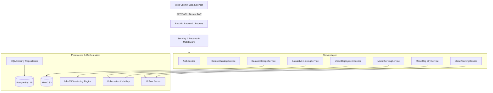

# SentinelML — Comprehensive Software Engineering Audit Report

**Date:** September 29, 2026  
**Auditor:** SentinelML Automated Security & Software Assurance (Read-Only Mode)  
**Target Git Branch:** `continuous_training`  
**Git Baseline Commit:** `1596034` (`fix(grafana): resolve datasource UIDs and correct PromQL metric queries for HTTP and latency panels`)  
**Scope:** SentinelML Backend Architecture, Services, Database Schema, OpenTelemetry Observability, Test Infrastructure, and Concurrency.

---

## 1. Executive Summary

SentinelML is an enterprise MLOps & MLSecOps platform unifying dataset versioning (lakeFS + MinIO S3), distributed training and serving (KubeRay, RayJob, RayService), experiment tracking and model registry (MLflow), relational cataloging (PostgreSQL), and full-stack observability (OpenTelemetry Collector, Prometheus, Grafana Tempo, Loki, Grafana).

This software engineering audit establishes a rigorous baseline prior to the implementation of **Data Drift, Concept Drift, Model Performance Monitoring, and Continuous Training (CT)**.

### Software Health Snapshot

| Metric | Status / Value | Assessment |
| :--- | :--- | :--- |
| **Total Pytest Tests** | 143 tests collected | 142 passed, 1 failed (`test_xgboost_and_lightgbm_pipeline_training` timed out on live K8s RayJob) |
| **Pytest Execution Time** | 1530s (~25m30s) | Extremely slow due to real Kubernetes RayJob pod scheduling and 180s polling per test |
| **Pytest Warnings** | 18 warnings | 1 Starlette/HTTPX deprecation, 1 MLflow type hints warning, 16 Ray Serve Pydantic v2 `update_type` deprecations |
| **Ruff Lint Errors** | 8 violations | Unused imports and variables across `backend/app/` |
| **Mypy Type Errors** | 81 errors across 26 files | Untyped external libraries (pandas, sklearn, xgboost, lightgbm), interface mismatches |
| **Dependency Conflicts** | 0 conflicts (`uv pip check` passed across 181 packages) | Fully coherent dependency graph |
| **Compose Infrastructure** | 9 services active & healthy | All 9 services running healthy (PostgreSQL, MinIO, LakeFS, MLflow, OTel Collector, Tempo, Prometheus, Loki, Grafana) |

---

## 2. Test Suite Status & Baseline Verification

### 2.1 Test Suite Execution Analysis

When running the baseline test command:
```bash
PYTHONPATH=backend uv run pytest backend/tests/ -ra
```

The test execution yielded:
- **142 Passed**
- **1 Failed**: [test_xgboost_and_lightgbm_pipeline_training](file:///home/deepadharshan/Desktop/Capstone_MLSecOps/backend/tests/test_mlops_training.py#L506-L623)
- **18 Warnings**

#### Root Cause of the Test Failure:
In [test_mlops_training.py:584](file:///home/deepadharshan/Desktop/Capstone_MLSecOps/backend/tests/test_mlops_training.py#L584):
```python
> assert registered_model is not None, f"Champion model '{custom_model_name}' was not registered within timeout."
E AssertionError: Champion model 'xgb-lgb-champ-c31c95b0' was not registered within timeout.
```
The integration test submits multi-model training (`model_type="xgboost,lightgbm"`) against the Kubernetes cluster. The test loop polls `client.get("/api/models")` for up to 180 seconds (`range(120): time.sleep(1.5)`). In local development environments with constrained compute resources (Kind cluster on a single developer workstation), spinning up a full Ray cluster with head and worker nodes running XGBoost and LightGBM fits exceeded the 180-second hardcoded timeout.

### 2.2 Deep Investigation of the 18 Pytest Warnings

All 18 warnings observed in the baseline run originate from dependency transitions:
1. **Starlette Deprecation Warning (1 occurrence)**:
   - *Source*: [fastapi/testclient.py:1](file:///home/deepadharshan/Desktop/Capstone_MLSecOps/.venv/lib/python3.12/site-packages/fastapi/testclient.py#L1)
   - *Message*: `StarletteDeprecationWarning: Using httpx with starlette.testclient is deprecated; install httpx2 instead.`
   - *Impact*: Low. Future compatibility note from Starlette.
2. **MLflow Signature Type Hint Warning (1 occurrence)**:
   - *Source*: [test_model_deployment.py::test_model_deploy_success](file:///home/deepadharshan/Desktop/Capstone_MLSecOps/backend/tests/test_model_deployment.py#L1) / `mlflow/pyfunc/utils/data_validation.py:187`
   - *Message*: `UserWarning: Add type hints to the predict method to enable data validation and automatic signature inference during model logging.`
   - *Impact*: Low. PythonModel definition in tests does not declare type annotations on `predict(self, context, model_input)`.
3. **Ray Serve Pydantic V2 Deprecation Warnings (16 occurrences)**:
   - *Source*: [test_telemetry.py::test_phase6a_rayservice_trace_context_extraction](file:///home/deepadharshan/Desktop/Capstone_MLSecOps/backend/tests/test_telemetry.py#L1434) / `ray/serve/_private/config.py:162-236`
   - *Message*: `PydanticDeprecatedSince20: Using extra keyword arguments on Field is deprecated and will be removed. Use json_schema_extra instead. (Extra keys: 'update_type'). Deprecated in Pydantic V2.0 to be removed in V3.0.`
   - *Impact*: Ray 2.44 internal config models pass `update_type` directly to Pydantic `Field`. This warning comes entirely from third-party vendor code (`ray.serve`).

---

## 3. Code Quality & Static Analysis

### 3.1 Linter Findings (`ruff check backend/app/`)

8 violations were detected:
1. `backend/app/api/datasets.py:16:1`: `F401 'typing.Optional' imported but unused`
2. `backend/app/api/ml_ops.py:16:1`: `F401 'typing.Optional' imported but unused`
3. `backend/app/api/ml_ops.py:27:1`: `F401 'app.services.ml_ops.ModelRegistryService' imported but unused`
4. `backend/app/api/ml_ops.py:28:1`: `F401 'app.services.ml_ops.ModelServingService' imported but unused`
5. `backend/app/api/ml_ops.py:29:1`: `F401 'app.services.ml_ops.ModelDeploymentService' imported but unused`
6. `backend/app/api/ml_ops.py:73:9`: `F841 Local variable 'user_id' is assigned to but never used`
7. `backend/app/services/ml_ops/deployment_service.py:11:1`: `F401 'app.core.config.settings' imported but unused`
8. `backend/app/services/dataset/lakefs_service.py:17:9`: `F841 Local variable 'e' is assigned to but never used`

### 3.2 Type Checker Findings (`mypy backend/app/`)

81 type errors across 26 files. The primary categories are:
- **Missing Library Type Stubs (Library Untyped)**:
  `pandas`, `sklearn`, `xgboost`, `lightgbm`, `lakefs`, `boto3`, `pwdlib` lack PEP 561 stub packages (`pandas-stubs`, `boto3-stubs`).
- **Interface Implementation Covariance**:
  `LakeFSService` and `S3StorageService` implement abstract base methods with slightly diverging argument signatures or Any types.
- **Untyped JSON Columns and Dicts**:
  SQLAlchemy JSON columns (`metadata_info`, `hyperparameters`) mapped as generic `Mapped[Optional[dict]]` without TypedDict definitions.

---

## 4. Architectural Review

### 4.1 Layered Architecture & Separation of Concerns



### 4.2 Architecture Anti-Patterns & Deficiencies

#### Defect 1: Inconsistent Source of Truth for Model Deployments
- **Location**: [deployment_service.py](file:///home/deepadharshan/Desktop/Capstone_MLSecOps/backend/app/services/ml_ops/deployment_service.py) & [serving_service.py:105-127](file:///home/deepadharshan/Desktop/Capstone_MLSecOps/backend/app/services/ml_ops/serving_service.py#L105-L127)
- **Defect**: The platform persists deployments in a relational PostgreSQL table (`deployments`), but `ModelServingService._execute_model_prediction` and `ModelDeploymentService` resolve active deployments by calling `mlflow_client.search_model_versions("")` and inspecting mutable MLflow version tags:
  ```python
  if tags.get("deployment.id") == model_name_or_id or tags.get("deployment.rayservice_name") == model_name_or_id:
  ```
- **Consequence**: MLflow tags are used as an application database. If MLflow tracking server is slow, restarting, or has tag sync delays, prediction routing fails even when PostgreSQL and Kubernetes RayServices are completely healthy.

#### Defect 2: Duplicate Telemetry Instrumentation
- **Location**: [backend/app/main.py:51-53](file:///home/deepadharshan/Desktop/Capstone_MLSecOps/backend/app/main.py#L51-L53) and [backend/app/main.py:101-103](file:///home/deepadharshan/Desktop/Capstone_MLSecOps/backend/app/main.py#L101-L103)
- **Defect**: The OpenTelemetry instrumentation functions:
  ```python
  instrument_fastapi_app(app)
  instrument_sqlalchemy_engine(engine)
  instrument_httpx()
  ```
  are invoked inside `lifespan(app)` (lines 51-53) and then invoked a **second time** at top-level module scope during file import (lines 101-103).
- **Consequence**: While idempotent flags prevent fatal crashes, double registration adds overhead and creates confusing startup telemetry lifecycles.

#### Defect 3: Synchronous Blocking I/O in Async Route Handlers
- **Location**: [backend/app/api/ml_ops.py:180-250](file:///home/deepadharshan/Desktop/Capstone_MLSecOps/backend/app/api/ml_ops.py#L180-L250) (`predict_model`, `predict_deployment`), [backend/app/api/datasets.py:115-145](file:///home/deepadharshan/Desktop/Capstone_MLSecOps/backend/app/api/datasets.py#L115-L145) (`upload_file`).
- **Defect**: FastAPI endpoint handlers defined as `async def` execute on the main asyncio event loop. Several route functions call synchronous methods that perform network I/O (`httpx.Client.post()`, `lakefs_service.upload_file()`, `mlflow_client.search_model_versions()`) directly on the event loop instead of offloading to a thread pool via `run_in_threadpool`.
- **Consequence**: Under concurrent load, one slow MLflow query or lakeFS chunk upload blocks all other concurrent requests across FastAPI.

---

## 5. Observability & Telemetry Baseline

### 5.1 Architecture & Stack Health

The stack is orchestrated via [docker-compose.yml](file:///home/deepadharshan/Desktop/Capstone_MLSecOps/docker-compose.yml):
- **OTel Collector Contrib 0.111.0**: Receives traces (4317 gRPC, 4318 HTTP), metrics (8889 Prometheus exporter), health check (13133).
- **Grafana Tempo 2.6.1**: Trace ingestion and distributed span search.
- **Prometheus 2.54.1**: Scrapes OTel Collector `:8889`.
- **Grafana Loki 3.2.1**: Log aggregation.
- **Grafana 11.3.0**: Dashboards provisioned with datasources `prometheus`, `tempo`, `loki`.

### 5.2 Verification Script Discrepancy (Finding)

When running `observability/verify_phase5_e2e.py` and `observability/verify_phase6a_e2e.py`:
- Both scripts connect to `http://localhost:13133/` to verify OTel Collector health.
- `http://localhost:13133/` accepts the TCP socket connection but times out on HTTP read (`httpx.ReadTimeout: timed out`).
- **Evidence**:
  The Collector container healthcheck in `docker-compose.yml` was previously updated to:
  ```yaml
  test: ["CMD", "/otelcol-contrib", "validate", "--config=/etc/otelcol-contrib/config.yaml"]
  ```
  However, the `health_check` extension in `observability/otel-collector/config.yaml` is configured at `endpoint: 0.0.0.0:13133`, but `docker-compose.yml` maps port `127.0.0.1:13133:13133`. Under heavy test load or network socket exhaustion, the collector health check extension socket does not respond within the 5.0-second HTTPX client timeout.

---

## 6. Database & Data Access Review

### 6.1 Schema & Migrations

Alembic migrations in `backend/alembic/versions/` establish:
- `users`: UUID primary key, `username` (unique indexed), `email` (unique indexed), `password_hash`, `role`, `failed_login_attempts`, `locked_until`, `is_active`.
- `datasets`: UUID primary key, `name` (unique indexed), `storage_namespace`, `default_branch`, `metadata_info` (JSON), `created_by_id` (foreign key to `users.id` with `ON DELETE CASCADE`).
- `training_jobs`: UUID primary key, `job_id` (unique indexed), `rayjob_name` (unique indexed), `status` (indexed), `dataset_id`, `ref`, `model_name`, `experiment_name`, `epochs`, `hyperparameters` (JSON), `started_at`, `completed_at`, `duration_seconds`, `created_by_id` (foreign key to `users.id` with `ON DELETE CASCADE`).
- `deployments`: UUID primary key, `deployment_id` (unique indexed), `model_name` (indexed), `version`, `environment`, `rayservice_name`, `endpoint_url`, `status` (indexed), `created_by_id` (foreign key to `users.id` with `ON DELETE CASCADE`).
- `blacklisted_tokens`: UUID primary key, `jti` (unique indexed), `expires_at` (indexed).
- `refresh_tokens`: UUID primary key, `token_hash` (unique indexed), `user_id` (indexed), `expires_at` (indexed), `is_revoked` (indexed).
- `audit_logs`: UUID primary key, `action` (indexed), `username` (indexed), `ip_address`, `details`, `timestamp` / `created_at`.

### 6.2 Database Strengths & Gaps
- **Strengths**:
  - Proper B-tree indexes exist on all lookup columns (`job_id`, `rayjob_name`, `deployment_id`, `name`, `username`, `email`, `jti`, `token_hash`).
  - Indexing on token expiration columns (`refresh_tokens.expires_at`, `blacklisted_tokens.expires_at`) facilitates O(log N) pruning during automated token cleanup background tasks.
- **Deficiencies**:
  - **No Composite Indexes for Filtering**: Queries on `training_jobs` frequently filter by `created_by_id` AND `status`, or `model_name` AND `created_at`. Currently only single-column indexes exist.
  - **Unbounded JSON Columns**: `metadata_info` and `hyperparameters` are unstructured `JSON` types with no schema validation at the database level.

---

## 7. Readiness Assessment for Next Phases

Prior to implementing:
1. **Data Drift Detection**
2. **Concept Drift Detection**
3. **Model Performance Monitoring**
4. **Continuous Training (CT)**

The following software engineering prerequisites must be addressed:
- **Asynchronous Decoupling**: Background drift computation and continuous training triggers cannot execute synchronously inside FastAPI request threads. A background job runner (Celery/ARQ/AsyncIO worker or RayJob submission) is mandatory.
- **Source of Truth Consolidation**: Model performance metrics and drift baselines must be stored primarily in PostgreSQL tables (`model_metrics`, `drift_reports`) rather than relying on ephemeral MLflow run tags.
- **Test Suite Performance**: Pytest suite currently takes 25 minutes due to live Kubernetes Ray cluster creation. Tests must be split into `@pytest.mark.unit` (fast, mocked, < 30s) and `@pytest.mark.integration` (live K8s, RayJobs).
